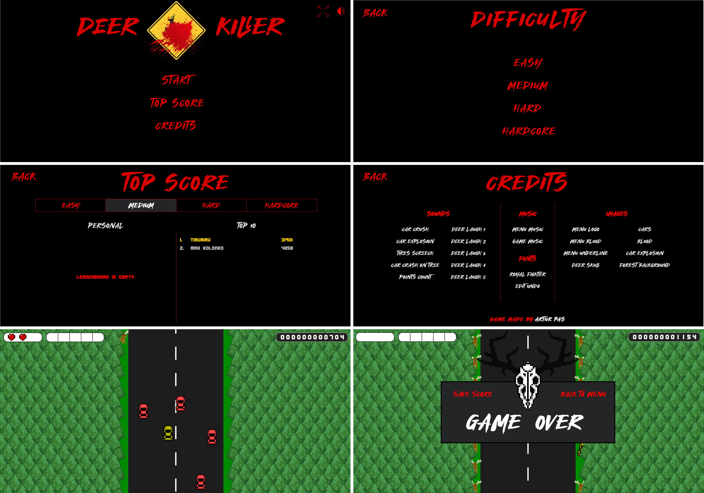

# DeerKiller
Arcade racing game with the goal to get as many points as possible in one attempt by killing deers and avoiding cars. 
See [live demo](https://pas-artur.000webhostapp.com/deer-killer/).

## Table of Contents
* [Technologies Used](#technologies-used)
* [Features](#features)
* [Setup](#setup)
* [Usage](#usage)
* [Project Status](#project-status)

## Technologies Used
- HTML5
- CSS3
- JS
- PHP 8.1.12
- Apache 2.4.54 
- phpMyAdmin 5.2.0

## Features
- Player movement
- Spawning enemies that kills player
- Spawning deers that can be killed by enemy or player giving him points
- Three lives, barrier when killed, energy and slowing time skill
- Points counter
- Saving best score
- Menu, Difficulty levels, Leaderboard and Credits
- Start animation
- Transition animations
- Game over slip and laughing deers animation
- Full screen and mute options

## Setup
What are the project requirements/dependencies? Where are they listed? A requirements.txt or a Pipfile.lock file perhaps? Where is it located?

Proceed to describe how to install / setup one's local environment / get started with the project.

## Usage
How does one go about using it?
Provide various use cases and code examples here.

`write-your-code-here`

## Project Status
Project is: complete

